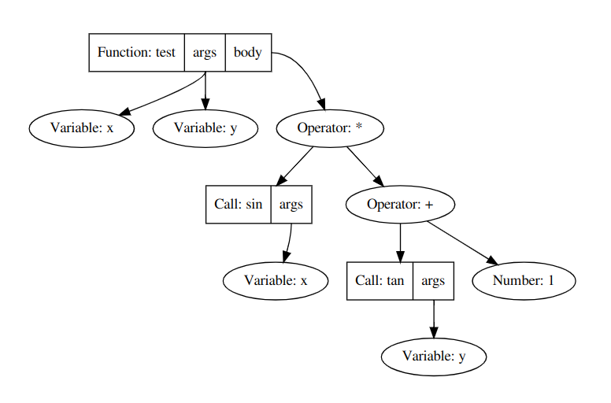
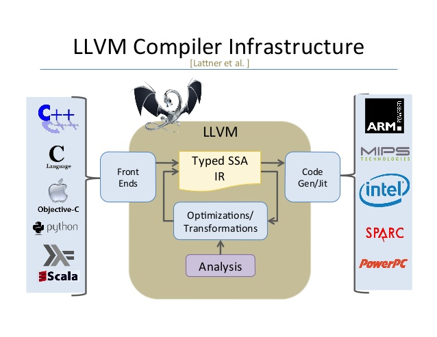

# plang
A very simple programming langage, made for fun and education. Based on LLVM IR. 

## Language design
### Logical expressions
For the moment, `plang` only support `+, -, <, *` as operators. Many more will be add in the future.

A simple logical expression is for example : `x + 1 * (4 + y)`. You can also call `extern` functions like `sin(x)` like that : `sin(x) * 4  + x`.

### Function definitions:
```
def function_name(arg1 arg2 ...) logical_expression
```
Not that there are not `,` between the argument (I find it more elegant).

## Experiment
You can compile the simple project using the `CMakeLists.txt` file and the standard process. 

```
$: sudo apt install cmake
$: mkdir build && cmake .. && make
```

Just run the compiler in terminal mode using `./plang` or with file by providing a file.

## Compiler design
### Parser & Lexer
`plang` is using a very simple tokenizer. The parser is a combinaison of a  [recursive descent parsing](https://en.wikipedia.org/wiki/Recursive_descent_parser) and an [order precedence parser](https://en.wikipedia.org/wiki/Operator-precedence_parser) for operations.

For example, `def test(x y) sin(x) * (tan(y) + 1)` produces this AST:



you can produces this kind of graphism using the `AST::show_tree(AST_Node* tree, std::string filename)` method. (you will need the `dot` command to make it works tho)

### Compilation and backend
The backend is powered by [LLVM](https://llvm.org) (same backend as C, C++, Julia, Objective-C and much more!)



## Credit

 - Created & Design : Paul Planchon (2021)